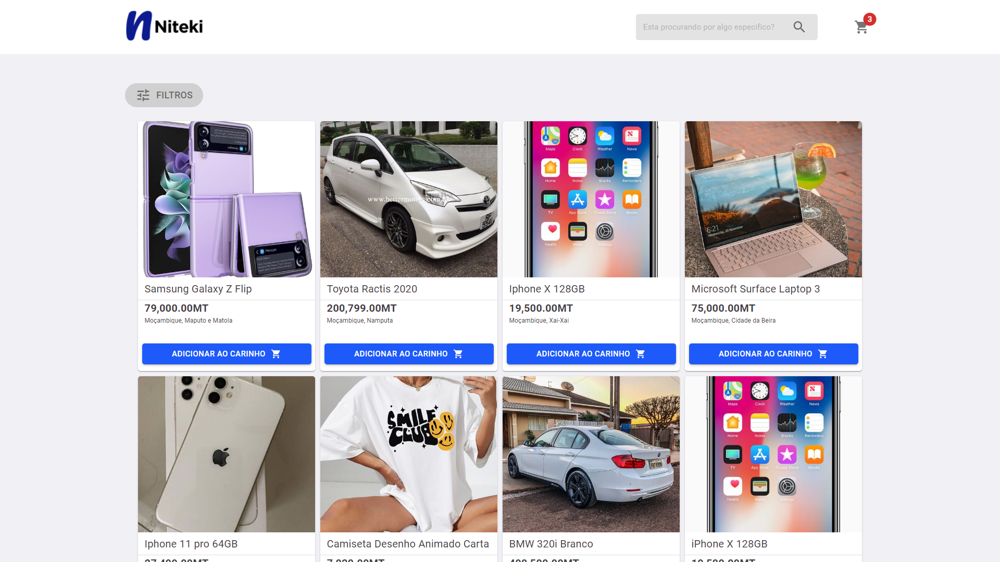
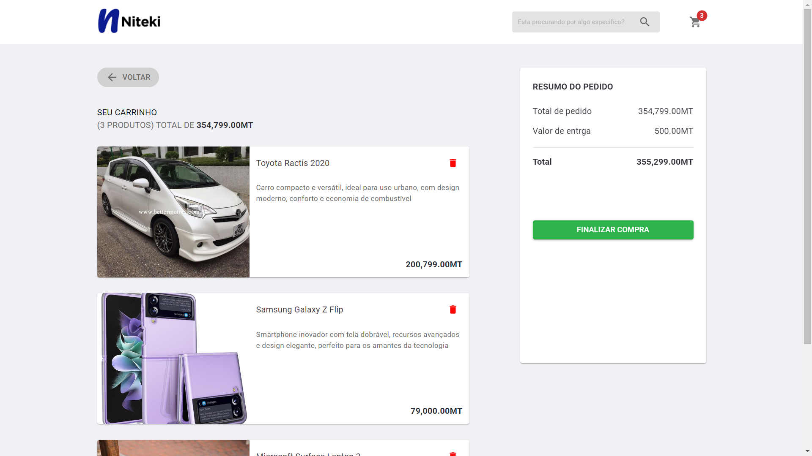
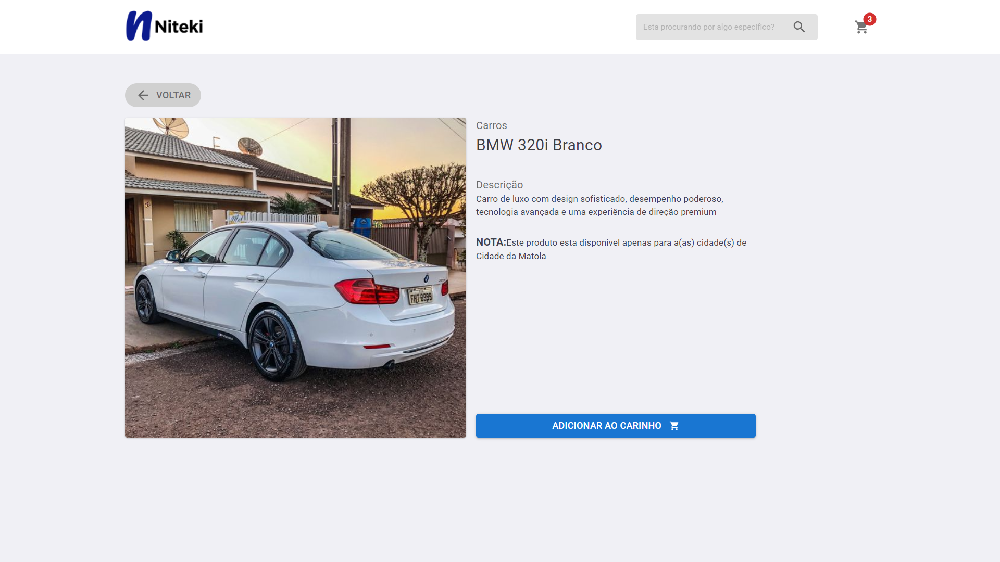

# NItekiShop_Challenge




#### Neste projeto (challenge) eu desenvolvi o website que dei o nome de <code>Niteki Shop</code> com as funcionalidades principais propostas no challenge que erram:
<li>Ao clicar em um produto da lista, exiba uma página com detalhes completes
do produto, incluindo nome, preço, descrição, etc.</li>
<li>
Implemente a funcionalidade de adicionar produtos ao carrinho de compras,
onde os usuários possam adicionar produtos, ver a quantidade total de itens
no carrinho e remover produtos do carrinho.</li>

### Adicionais
<li>Perquisa do produto pelo nome</li>
<li>Filtro do produto quano ao tipo de produto</li>

#### É de notar que dexei o site 100% responssivo podendo se adaptar a telas maiores até telas menores.

# Tecnologias usadas
<li>Typescript</li>
<li>Javascript</li>
<li>Materil UI</li>
<li>Css</li>

<br>

# Intalação
1. Clone o reposiotio usando o seguinte comando
```bash
git clone https://github.com/CairoSergio/NItekiShop_Challenge.git
```

2. Entre no projeto
```bash
cd NitekiShop_Challenge
```

3. Instalar as dependencias
```bash
npm install
```
ou
```bash
yarn install
```

3. Inicialize o projeto
```bash
yarn dev
```
<br/>

# Deploy
#### Você pode tambem acessar o projeto em dempo real atravaz do link: [nitekishop.vercel.app](nitekishop.vercel.app)

# Conacto
#### Em caso de duvidas entre em contacto comigo atravez do meu email: [cairosergiondava@gmail.com](cairosergiondava@gmail.com)

